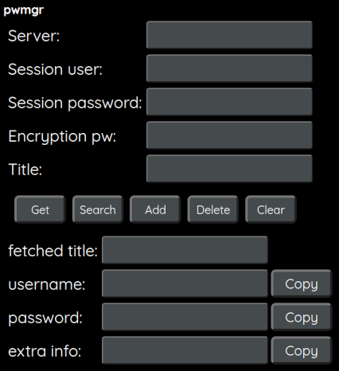

# pwmgr
A centralized password manager with distributed encryption.

## Description
The server part listens to connections from a client and verifies the access with session credentials that are predefined through the init command. Multiple clients can be used as long as they are aligned against the server with the same credentials given with init.
<br><br>The security functionality is based on a strong encryption of every record that is performed client-side before the data sent to the server. Even if the server DB is compromised or the communication is eavesdropped, the records themselves will still be safe through the encryption.
<br><br>The database file is automatically encrypted/decrypted with the session password. Note that this is a separate password from what is used for encrypting the records, encrypted by the client.
<br><br>If keyctl is available in the client environment, it will be used for a temporary user keyring to avoid encryption password user input multiple times within a certain timespan.

## Server
- Choose folder path for the DB to be stored in the config.py.
- Run the application: 
- ```python3 -u main.py```

### Docker / Podman

There is a Docker image available:
https://hub.docker.com/r/schnitz81/pwmgr-server

Alt. use the Dockerfile to build it. The appropriate port needs to be forwarded and the /db folder mounted for persistence. See comments in Dockerfile for run example.


## Client

### Requirements

The client needs netcat-openbsd, openssl and gzip. 

### Installation
Download the client file and make it executable.<br>
Example:<br>
```wget -O /usr/local/bin/pwmgr https://raw.githubusercontent.com/schnitz81/pwmgr/main/client/pwmgr.sh && chmod +x /usr/local/bin/pwmgr```

### Usage

Run command:<br> 
```pwmgr (parameter)```

Init must be run first to create a session before the other commands can be used. This is the base of the client<->server interaction. 

- init / config<br>
  Create a session. This creates a local session config and attempts to create a remote server db session. If the username db already exists, it's reused. Previous session password must match.<br>
  By entering the same sessionuser/sessionpassword  multiple clients can be used with the same server DB.<br>
  If a [user].encdb is missing in the db_path, importing an unencrypted [user].db file will be attempted instead.<br>
  Optional:<br>
  --nonew  : Expect an already existing user DB in the server. Exit without
  action if it's not found.<br><br>
- init-change / config-change / configchange<br>
  Change credentials of an existing session. Old credentials must be given for verification.<br><br>
- status / check / connection / test<br>
  Check session status against the server.<br><br>
- add / encrypt / enc / put / save [(title)]<br>
  Add a new record.<br>
  Fields stored:<br>
  - Title/Name
  - username
  - password
  - Extra field (optional/may be blank)

  Encryption password selection is prompted. The encryption of the individual record will be as strong as this password.<br><br>
- get / decrypt / dec / fetch / show / load [(title)]<br>
  Fetch a stored record to view. Same encryption password as when the record was stored must be entered.<br>
  Optional:<br>
  -c / --copy  : Attempt to automatically copy password to the X clipboard
  using xclip.<br>
  --nomask  : Don't mask the password in the output.<br><br>

- list / search [(title)]/[all]<br>
  Search for a record with partial name.<br><br>
- delete / remove / del [(title)]<br>
  Delete a record.<br><br>
- update / change / edit<br>
  Change a record, e.g. change the password stored.<br>
  If the name of the record already exists, it's not possible to use "add" to overwrite, but this command must be used instead.<br><br>
- backup / dump<br>
  Dump the .encdb DB file of the current session to an unencrypted .db file.
  For backup or debugging purpose. The [user].db file will automatically be
  imported and converted to .encdb when running "init" if no [user].encdb file
  is found in the db_path.

### Environment variables

Some of the config file settings can be overridden by env variables. This is especially useful for the Docker image.<br>
```HOST=0.0.0.0```<br>
```PORT=48222```<br>
```VERBOSE_OUTPUT=false```<br>

These can be used when running Docker/Podman:<br>
```-e VERBOSE_OUTPUT=false```<br>

## Web-app



The web-app is an alternative way of using the client. It also makes it easier to use pwmgr on mobile devices where terminals are rarely used.
Since it only interacts with the terminal based client, it only needs the client part and can be run separately from the pwmgr server. 

### Requirements

#### Server
- Only built-in Python modules are used by the server application.
- openssl
- base64

#### Webapp
- The webapp Python3 dependencies are listed in the requirements file in the webapp subfolder.

#### Client
- BSD version of netcat (package commonly named `netcat-openbsd`)
- openssl (available in most base installations)
- base64 (available in most base installations)
- gzip (available in most base installations)

<b>Client optional:</b>
- keyctl from `keyutils` package (for remembering last used encryption password for a limited time)
- xclip (for autosaving password to clipboard)

### Usage

- See comments in Dockerfile for build and run example as container. Or:<br>
- Use pip to install the requirements and install the client manually with the dependencies as above.
- Run with: ```python -u main.py```<br>
